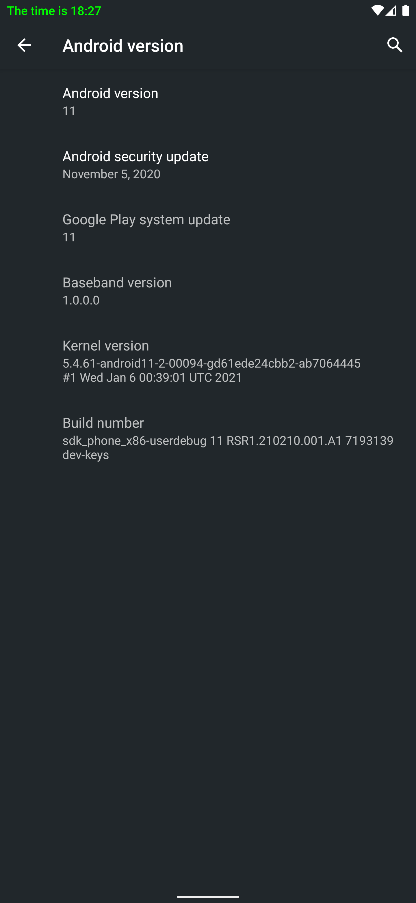

# LSposed Module Example

An example LSposed (Xposed) module based on the ["RedClock" tutorial by rovo89](https://github.com/rovo89/XposedBridge/wiki/Development-tutorial) that works on recent Android versions.

## What is LSposed?
You can read about LSposed in their GitHub repository [here](https://github.com/LSPosed/LSPosed#introduction).

## Screenshot

